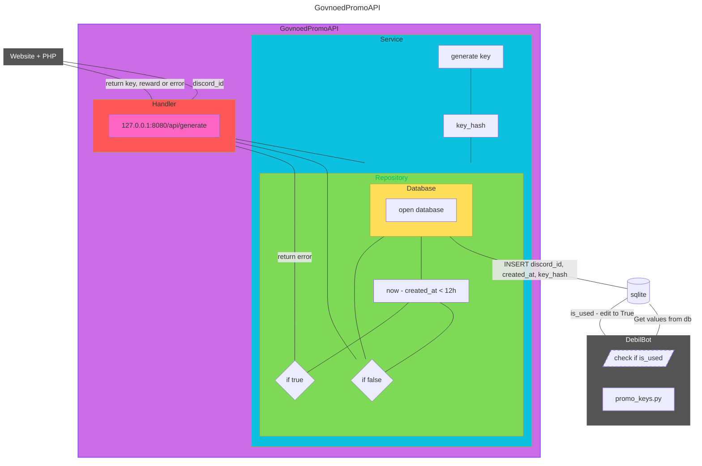

<h1 align="center">
     
    DebilBot
</h1>


# GovnoedPromoAPI

  


## Description

This project is a refactored backend for the [govnoed.de](https://govnoed.de/) website.

The API uses an external SQLite database, communicates with the website through HTTP API endpoints, and generates promo codes for [debilbot](https://github.com/tidurak/debilbot).


## Project Status

The project is in its final stage. Future bug fixes and other minor fixes may still be made.


## Project Structure
```
├── cmd/
│   └── api/
│       └── main.go # API entry point
└── internal/
    ├── config/
    │   └── config.go # Configuration loading and validation
    ├── database/
    │   ├── database.go # SQLite connection
    │   ├── migrations/
    │   │   └── 001_create_redeem_keys.sql # Creates the redeem keys table
    │   │                             
    │   └── migrations.go # Database migration management
    ├── handler/
    │   ├── generateRequest.go # Key generation request structure
    │   ├── generateResponse.go # Key generation response structure
    │   ├── health.go # HTTP health check
    │   ├── promo.go # Promo key HTTP handlers
    │   └── response.go # HTTP response helpers
    ├── repository/
    │   └── promo.go # Promo key database operations
    └── service/
        └── promo.go # Promo key business logic
```




## FAQ

Q: Why was the backend rewritten?  
A: As of 23 August 2026, the current [govnoed.de](https://govnoed.de/get_key) backend is written in PHP. PHP was the best choice for my website at the time. However, the project quickly became difficult to scale and turned into an unreadable mess.


Q: Why Go instead of Rust, Django, or Node.js?  
A: The goal was to build a lightweight API because my VPS has very limited resources. The choice ultimately came down to Rust and Go. I chose Go because it keeps the code much simpler with only a small loss in performance. I also had no prior experience with Rust.
